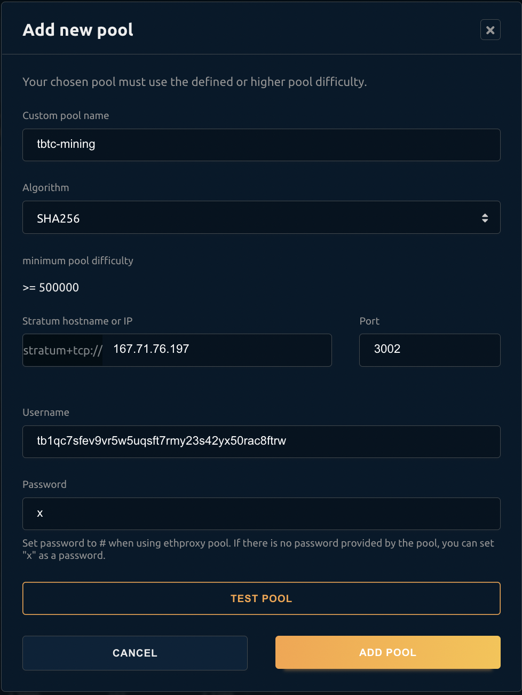
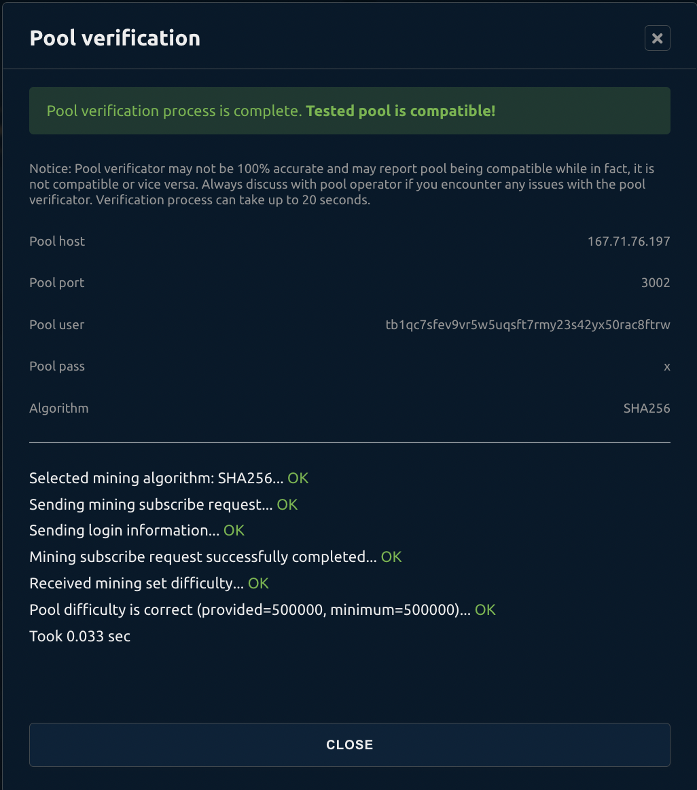

# Usage Instructions

### Requirements:
 * Docker and docker-compose
 * At least 100GB of free disk space

#### Clone repo
```shell
git clone https://github.com/zone117x/tbtc-mining.git
cd tbtc-mining/
```

#### Configure mining reward address
Specify the testnet btc address in the `TBTC_ADDRESS` environment variable inside [`docker-compose.yml`](docker-compose.yml).

#### Optionally, to speed up testnet chain sync, use the bootstrap bitcoin testnet chain data with:
```shell
./bootstrap-chain.sh
```

#### Run services with:
```shell
docker-compose up
```

#### Transfering tBTC
First, determine the bitcoin docker container ID:
```shell
docker-compose ps -q bitcoin
# d40f951ff1aa072425110422732fb79b55f34af652d2e653cb94156ee73ad004 (example output)
```

Verify `bitcoin-cli` is working with:
```shell
docker exec <YOUR_CONTAINER_ID> bitcoin-cli -rpcport=18332 -rpcuser=rpcuser -rpcpassword=rpcpassword getmininginfo
```

Create a wallet with [`createwallet`](https://developer.bitcoin.org/reference/rpc/createwallet.html):
```shell
docker exec <YOUR_CONTAINER_ID> bitcoin-cli -rpcport=18332 -rpcuser=rpcuser -rpcpassword=rpcpassword createwallet ""
```

Import the private key to your mining reward address with [`importprivkey`](https://developer.bitcoin.org/reference/rpc/importprivkey.html):
```shell
docker exec <YOUR_CONTAINER_ID> bitcoin-cli -rpcport=18332 -rpcuser=rpcuser -rpcpassword=rpcpassword importprivkey "<YOUR_PRIVATE_KEY>"
```

Send tBTC with [`sendtoaddress`](https://developer.bitcoin.org/reference/rpc/sendtoaddress.html):
```shell
docker exec <YOUR_CONTAINER_ID> bitcoin-cli -rpcport=18332 -rpcuser=rpcuser -rpcpassword=rpcpassword sendtoaddress "<RECIPIENT_ADDRESS>" <tBTC_AMOUNT>
```

## Mining with NiceHash

Place a new order on the SHA256 hashpower marketplace.

* Ensure selected algorithm is `SHA256`.
* Fill in the public server IP / hostname.
* Specify the pool port configured in [`foundation-server/configs/pools/bitcoin.js`](foundation-server/configs/pools/bitcoin.js), the default is `3002`.
* For username, specify the same tbtc address used for the above `TBTC_ADDRESS` config, the default is `tb1qc7sfev9vr5w5uqsft7rmy23s42yx50rac8ftrw`.
* Password does not matter, use a placeholder like `x`.



Click "test pool" and all tests should pass:


